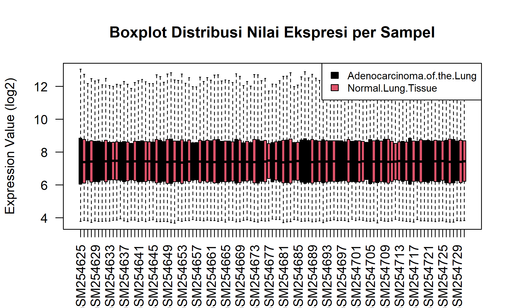
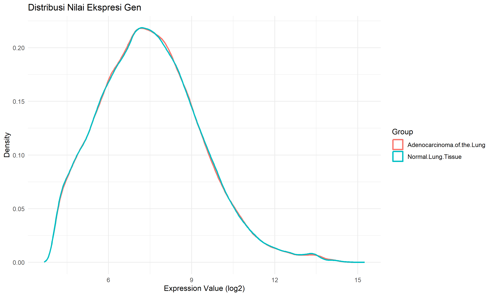
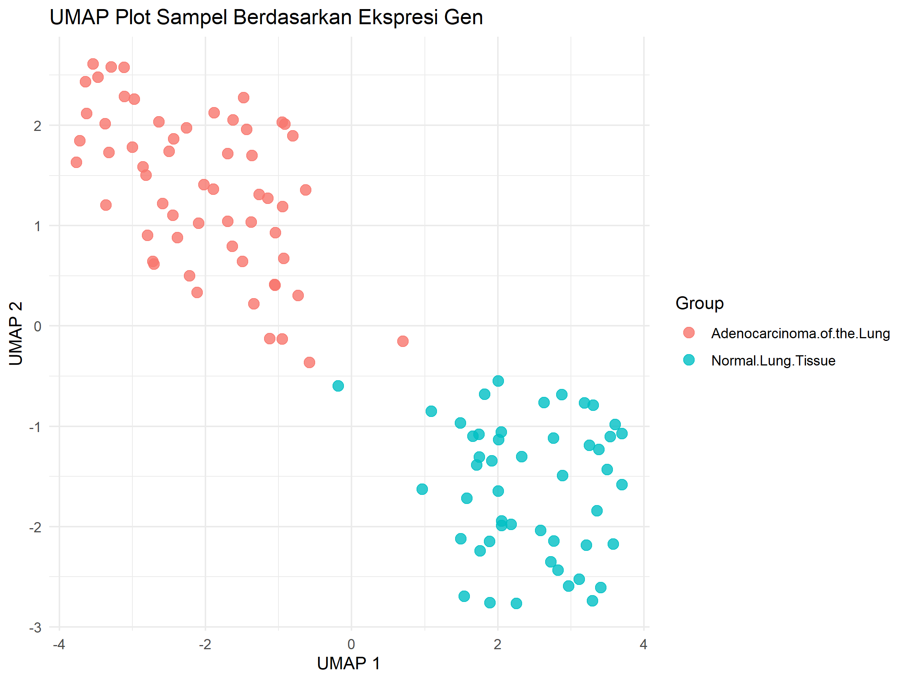
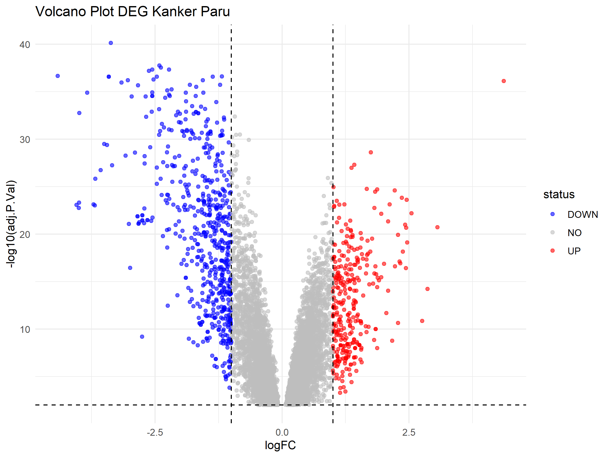
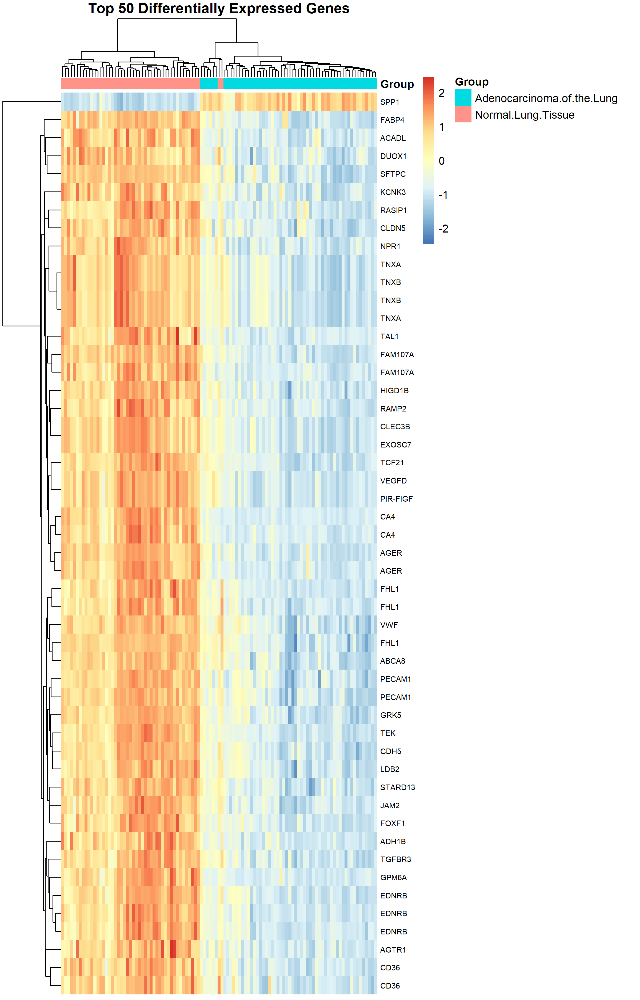
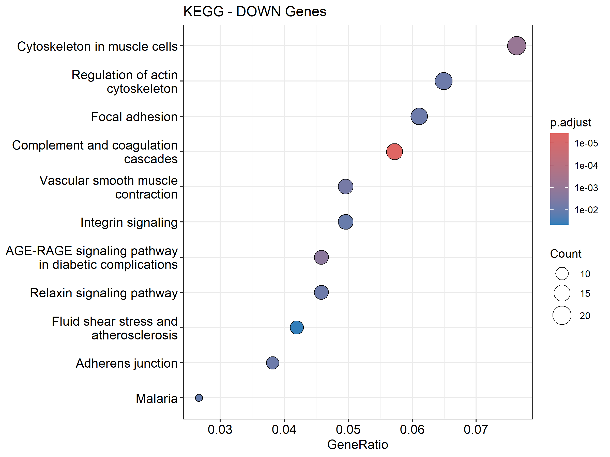
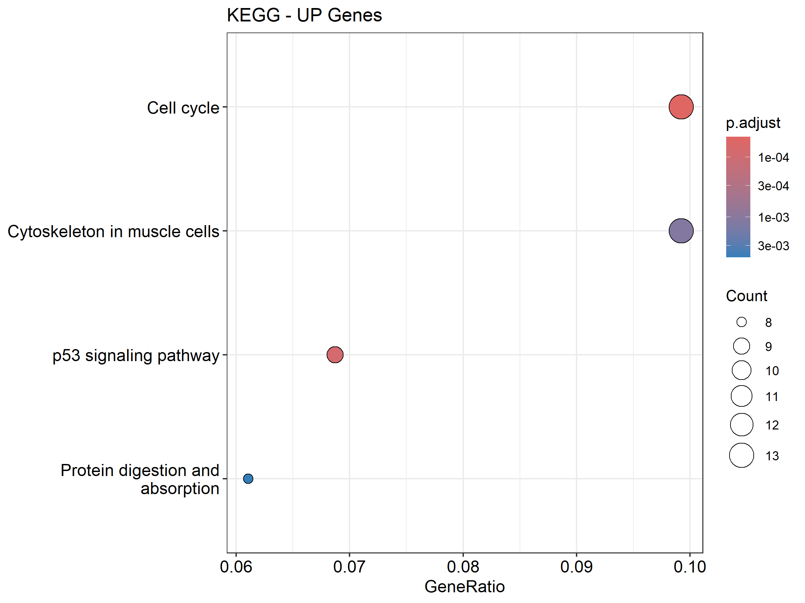

238_Week3
================
Brenda Febrina Zusriadi
2026-02-22

# 1. Pendahuluan

Penelitian ini menggunakan dataset dari Landi et al. (2008) yang
melibatkan profil ekspresi gen pada 135 sampel jaringan paru
(adenokarsinoma dan normal) dari berbagai kategori riwayat merokok yang
divalidasi secara biokimia. Menggunakan teknologi chip Affymetrix
HG-U133A, studi ini bertujuan untuk memahami pengaruh paparan asap rokok
terhadap perubahan transkriptomik dan progresivitas kanker.

Tujuan utama dari analisis ini adalah melakukan re-analisis data
menggunakan bahasa pemrograman R melalui pendekatan Differential
Expression Analysis. Fokus analisis adalah untuk mengidentifikasi
perbedaan ekspresi gen antara jaringan sehat dan adenokarsinoma guna
menemukan penanda molekuler potensial dalam patogenesis kanker paru.

# 2. Metode

Analisis data dilakukan menggunakan bahasa pemrograman R dengan alur
kerja bioinformatika sebagai berikut:

1.  Sumber Data (Data Source) Data diperoleh dari database publik NCBI
    Gene Expression Omnibus (GEO) dengan nomor akses GSE10072. Dataset
    ini menggunakan platform Affymetrix HG-U133A (GPL96). Data diunduh
    menggunakan paket GEOquery dalam format ExpressionSet yang mencakup
    matriks ekspresi gen dan metadata sampel.

2.  Pra-pemrosesan (Preprocessing) Tahap ini dilakukan untuk memastikan
    data layak dianalisis secara statistik:

- Transformasi Log2: Dilakukan pengecekan distribusi nilai melalui
  kuantil. Jika data belum terstandardisasi, dilakukan transformasi
  $\log_2$ untuk menstabilkan varians dan memudahkan interpretasi fold
  change.

- Anotasi: Menggunakan paket hgu133a.db untuk memetakan (mapping) ID
  probe Affymetrix ke dalam Gene Symbol dan Gene Name resmi agar hasil
  analisis memiliki makna biologis.

- Quality Control: Distribusi nilai ekspresi antar sampel divalidasi
  menggunakan Boxplot dan Density Plot untuk memastikan tidak ada batch
  effect yang ekstrem.

3.  Analisis DEG (Differential Expression Analysis) Identifikasi gen
    yang terekspresi secara berbeda dilakukan dengan paket limma:

- Design Matrix: Dibuat matriks desain tanpa intercept untuk
  membandingkan kelompok Adenokarsinoma terhadap paru-paru Normal.

- Linear Model & Empirical Bayes: Fungsi lmFit() dan eBayes() digunakan
  untuk menghitung statistik guna menstabilkan estimasi varians pada
  jumlah sampel yang kecil.

- Kriteria Signifikansi: Gen diklasifikasikan sebagai DEG jika memiliki
  nilai Adjusted P-value \< 0,01 (menggunakan koreksi FDR) dan nilai
  \|log2 Fold Change\| \> 1.

4.  Visualisasi (Heatmap & Dimensionality Reduction)

- Heatmap: Menggunakan paket pheatmap terhadap 50 gen paling signifikan
  (Top 50 DEGs). Data diskalakan menggunakan Z-score per baris untuk
  menonjolkan perbedaan pola ekspresi antar grup.

- UMAP: Dilakukan reduksi dimensi menggunakan algoritma UMAP untuk
  memvisualisasikan pengelompokan sampel secara global berdasarkan
  profil transkriptomik.

- Volcano Plot: Digunakan untuk memvisualisakan hubungan antara tingkat
  signifikansi ($-log_{10} P$-value) dan besarnya perubahan ekspresi
  ($log_2$ Fold Change).

5.  Analisis Pengayaan (Enrichment Analysis) Setelah mendapatkan daftar
    gen (UP-regulated dan DOWN-regulated), dilakukan interpretasi fungsi
    biologis menggunakan paket clusterProfiler: -Gene Ontology (GO)
    Enrichment: Fokus pada Biological Process (BP) untuk melihat
    aktivitas seluler yang terpengaruh.

-KEGG Pathway Analysis: Mengidentifikasi jalur metabolisme atau
pensinyalan spesifik (seperti jalur kanker) yang diperkaya oleh daftar
gen tersebut.Visualisasi hasil pengayaan ditampilkan dalam bentuk
Dotplot untuk melihat rasio gen dan nilai signifikansi setiap jalur
biologis.

# 3. Hasil dan Interpretasi

1.  Boxplot  Visualisasi Boxplot
    menunjukkan distribusi nilai ekspresi yang homogen di seluruh sampel
    tanpa adanya outlier teknis yang signifikan. Hal ini mengonfirmasi
    efektivitas tahap pra-pemrosesan data dan menjamin validitas
    perbandingan statistik pada tahap analisis gen diferensial (DEG)
    berikutnya.

2.  Density Plot  Hasil
    visualisasi Density Plot secara konsisten menunjukkan bahwa dataset
    GSE10072 memiliki kualitas yang sangat baik. Data terdistribusi
    secara seragam antar sampel dan identik antar kelompok perbandingan.
    Dengan demikian, asumsi normalisasi terpenuhi, dan dataset ini
    memiliki validitas tinggi untuk dilanjutkan ke tahap identifikasi
    Differentially Expressed Genes (DEG).

3.  UMAP Plot  Hasil visualisasi UMAP
    menunjukkan pemisahan klaster yang sangat jelas antara kelompok
    Normal Lung Tissue dan Adenocarcinoma of the Lung. Tidak
    ditemukannya tumpang tindih antar kelompok serta jarak antar klaster
    yang signifikan mengonfirmasi adanya perbedaan profil transkriptomik
    yang masif antara jaringan sehat dan tumor. Hal ini memvalidasi
    bahwa dataset GSE10072 memiliki kekuatan statistik yang sangat baik
    untuk dilanjutkan ke analisis gen diferensial (DEG).

4.  Volcano Plot  Analisis
    ekspresi gen diferensial (DEG) pada dataset GSE10072
    divisualisasikan menggunakan Volcano Plot untuk menggambarkan
    hubungan antara signifikansi statistik ($-log_{10}$ adjusted
    p-value) dan besarnya perubahan ekspresi ($log_{2}$ fold change).
    Dengan menetapkan ambang batas $|logFC| > 1$ dan $adj.P.Val < 0.01$,
    hasil plot menunjukkan sebaran gen yang mengalami perubahan ekspresi
    secara signifikan antara kelompok Adenokarsinoma dan Normal.

Titik-titik berwarna pada plot merepresentasikan gen yang terekspresi
secara diferensial: titik merah di sisi kanan menunjukkan gen yang
mengalami peningkatan ekspresi (up-regulated), sementara titik biru di
sisi kiri menunjukkan gen yang mengalami penurunan ekspresi
(down-regulated). Keberadaan titik-titik pada posisi ekstrem (paling
atas dan paling samping) mengindikasikan adanya perubahan molekuler yang
sangat kuat pada adenokarsinoma paru. Secara khusus, terlihat bahwa
jumlah gen yang mengalami down-regulation cukup dominan dengan tingkat
signifikansi yang sangat tinggi. Hal ini secara biologis mengindikasikan
hilangnya banyak fungsi seluler paru-paru normal selama proses
transformasi menjadi sel kanker.

4.  Heatmap  Heatmap ini
    menunjukkan perbedaan profil genetik yang drastis antara jaringan
    paru normal dan adenokarsinoma paru, di mana pemisahan sampel
    (clustering) yang terbagi sempurna menjadi dua blok besar
    membuktikan adanya perubahan mekanisme genetik yang signifikan pada
    sel kanker. Secara visual, hasil ini menonjolkan adanya aktivasi gen
    penanda kanker (up-regulation) yang kuat pada gen seperti SPP1
    (Osteopontin), yang berperan dalam mendorong pertumbuhan tumor dan
    potensi metastasis. Di sisi lain, terjadi fenomena kehilangan
    identitas sel normal (down-regulation) yang masif, di mana mayoritas
    dari 50 gen utama seperti AGER, SFTPC, FABP4, dan CA4 mengalami
    penurunan ekspresi yang tajam pada sampel kanker. Hal ini
    menginterpretasikan bahwa kanker paru tidak hanya memicu munculnya
    “gen jahat”, tetapi juga mematikan fungsi vital paru-paru seperti
    pertukaran gas dan produksi surfaktan. Kesimpulannya, kontras warna
    yang tajam pada heatmap ini mengonfirmasi perubahan besar pada jalur
    komunikasi sel, sehingga gen-gen tersebut berpotensi besar menjadi
    biomarker diagnostik akurat maupun target terapi masa depan yang
    berfokus pada penekanan aktivitas pemicu tumor sekaligus
    perlindungan integritas jaringan paru yang sehat.

5.  Gene Ontology GO ALL DEG (Gabungan gen yang naik dan turun)  Grafik pengayaan GO BP ini menunjukkan
    bahwa perubahan ekspresi gen secara keseluruhan sangat terfokus pada
    mekanisme siklus sel dan replikasi materi genetik. Proses biologis
    yang paling signifikan diperkaya adalah regulasi proses metabolik
    DNA dan replikasi DNA, yang ditandai dengan nilai GeneRatio
    tertinggi dan warna merah pekat yang menunjukkan signifikansi
    statistik yang sangat kuat ($p.adjust \approx 10^{-15}$). Selain
    itu, terdapat pengayaan yang menonjol pada mekanisme transportasi
    seluler, seperti lokalisasi protein ke organel, transpor
    nukleositoplasma, dan transpor vesikel Golgi, yang mengindikasikan
    adanya aktivitas perdagangan protein yang sangat aktif di dalam sel.
    Proses terkait pembelahan sel seperti transisi fase siklus sel
    mitotik dan regulasi organisasi kromosom juga muncul secara
    signifikan, memperkuat indikasi bahwa sel-sel ini berada dalam
    kondisi proliferasi yang sangat cepat. Menariknya, jalur fungsional
    seperti penyembuhan luka (wound healing) dan adhesi sel-substrat
    juga ikut terpengaruh, yang dalam konteks kanker sering kali
    berkaitan dengan kemampuan sel untuk bermigrasi dan melakukan invasi
    ke jaringan sekitar. Secara keseluruhan, data ini
    menginterpretasikan bahwa profil genetik pasien mengalami
    pemrograman ulang yang masif untuk mendukung replikasi DNA yang
    intensif dan kegagalan regulasi siklus sel normal, yang merupakan
    ciri khas dari progresivitas tumor yang agresif.

GO DOWN DEG (Gen yang aktivitasnya menurun) 

Grafik pengayaan GO BP untuk gen yang mengalami penurunan ekspresi
(Down-regulated) ini menunjukkan bahwa dampak serangan kanker tidak
hanya tentang pertumbuhan tumor, tetapi juga tentang kehancuran
infrastruktur pendukung pada jaringan paru-paru. Proses biologis yang
paling terpukul secara signifikan adalah regulasi perkembangan vaskular
(pembuluh darah) dan angiogenesis, yang ditandai dengan titik merah
pekat dan GeneRatio tertinggi. Hal ini mengindikasikan bahwa kemampuan
tubuh untuk membangun dan merawat jaringan pembuluh darah yang sehat
telah lumpuh total. Selain itu, terdapat penurunan drastis pada fungsi
organisasi matriks ekstraseluler dan struktur eksternal sel, yang secara
biologis berarti “fondasi” atau kerangka kokoh yang menjaga bentuk
paru-paru sedang mengalami degradasi masif.

Menariknya, proses seperti penyembuhan luka (wound healing) dan adhesi
sel-substrat juga muncul dalam daftar gen yang menurun, yang menunjukkan
bahwa sel-sel sehat kehilangan daya rekat dan kemampuan alaminya untuk
memperbaiki diri. Penurunan pada jalur morfogenesis jantung dan
perkembangan sistem ginjal juga terdeteksi, yang mencerminkan hilangnya
instruksi genetik untuk menjaga fungsi organ yang kompleks. Secara
keseluruhan, data ini menginterpretasikan bahwa sel kanker telah
melakukan “sabotase” terhadap sistem pendukung kehidupan di paru-paru,
mematikan aliran nutrisi melalui pembuluh darah normal dan menghancurkan
arsitektur jaringan, yang pada akhirnya membuat paru-paru kehilangan
fungsinya sebagai organ pernapasan yang sehat.

GO UP DEG (Gen yang aktivitasnya meningkat)  Grafik pengayaan GO BP untuk gen yang mengalami
peningkatan ekspresi (Up-regulated) ini menunjukkan gambaran yang sangat
kontras, di mana aktivitas genetik sel sepenuhnya didominasi oleh
mekanisme pembelahan sel (mitosis) yang agresif. Proses biologis yang
paling signifikan diperkaya adalah segregasi kromosom, baik di tingkat
nuklear maupun pada kromatid saudara (sister chromatid segregation),
yang ditandai dengan titik-titik merah pekat dan GeneRatio yang sangat
tinggi. Hal ini mengindikasikan bahwa mesin pembelahan sel sedang
bekerja dalam kecepatan penuh, memastikan setiap sel kanker baru
mendapatkan materi genetik untuk terus memperbanyak diri.

Selain itu, terdapat fokus yang intens pada pengaturan infrastruktur
pembelahan, seperti organisasi sitoskeleton mikrotubulus yang terlibat
dalam mitosis dan perakitan gelendong mitotik (mitotic spindle).
Keberadaan jalur pos pemeriksaan (checkpoint signaling) yang juga ikut
meningkat menunjukkan bahwa sel-sel ini memiliki kontrol ketat untuk
memastikan proses pembelahan yang cepat tersebut berjalan tanpa
hambatan, meskipun terjadi secara abnormal. Secara keseluruhan, data ini
menginterpretasikan bahwa sel kanker telah mengaktifkan mode
“proliferasi tanpa batas,” di mana energi dan sumber daya genetik sel
dikerahkan sepenuhnya untuk replikasi kromosom dan pemisahan sel yang
masif, yang merupakan pendorong utama pertumbuhan tumor yang sangat
cepat.

7.  KEGG Pathway Profil Fungsional Global (KEGG ALL DEG) 

Grafik pengayaan jalur KEGG ini memberikan gambaran tentang perubahan
peta komunikasi dan sistem operasional sel secara global, di mana sel
tidak lagi berjalan sesuai fungsi normalnya. Penemuan yang paling
menonjol adalah munculnya berbagai jalur terkait infeksi virus dan
karsinogenesis viral, seperti infeksi virus Epstein-Barr dan Human
T-cell leukemia virus 1, yang ditandai dengan warna merah pekat dan
signifikansi statistik yang tinggi ($p.adjust \approx 10^{-9}$). Hal ini
menginterpretasikan bahwa sel kanker telah membajak jalur-jalur yang
biasanya digunakan virus untuk mengambil alih kendali sel,
memungkinkannya untuk menghindari deteksi sistem imun dan terus
berkembang biak.Selain itu, terdapat gangguan signifikan pada jalur
siklus sel (cell cycle) dan replikasi DNA, yang memperkuat bukti adanya
pertumbuhan sel yang tidak terkendali. Jalur komunikasi fisik sel juga
mengalami perombakan besar melalui mekanisme focal adhesion dan integrin
signaling, yang mengindikasikan bahwa sel kanker sedang mengubah cara
mereka berinteraksi dengan lingkungan sekitarnya—sering kali untuk
memfasilitasi pergerakan sel ke bagian tubuh lain. Munculnya jalur
resistensi inhibitor EGFR tirosin kinase juga memberikan peringatan
klinis yang penting, karena menunjukkan bahwa sel-sel ini mungkin
memiliki kemampuan alami untuk melawan jenis pengobatan kanker tertentu.
Secara keseluruhan, data ini menunjukkan sebuah “kekacauan sistemik” di
mana sel telah membuang program kesehatan normalnya dan mengadopsi
jalur-jalur agresif yang mirip dengan mekanisme infeksi virus untuk
bertahan hidup dan menyebar.

Jalur KEGG Down DEG  Grafik
pengayaan jalur KEGG untuk gen yang mengalami penurunan ekspresi
(Down-regulated) ini menyingkap sisi lain dari dampak kanker, yaitu
kerusakan pada sistem kendali mekanik dan pertahanan alami sel. Jalur
yang paling signifikan mengalami penurunan adalah jalur komplemen dan
kaskade koagulasi (complement and coagulation cascades), yang ditandai
dengan titik merah paling pekat. Hal ini menginterpretasikan bahwa
sistem imun pelengkap dan mekanisme pembekuan darah normal di area
paru-paru tersebut sedang ditekan atau tidak berfungsi, yang bisa
melemahkan perlindungan jaringan terhadap ancaman luar.

Selain itu, terdapat penurunan drastis pada jalur yang mengatur
“arsitektur” dan pergerakan sel, seperti sitoskeleton pada sel otot,
regulasi sitoskeleton aktin, serta focal adhesion dan adherens junction.
Secara biologis, ini berarti sel-sel sehat sedang kehilangan kemampuan
untuk mempertahankan struktur yang kokoh dan komunikasi fisik antar sel,
sehingga integritas jaringan paru menjadi rapuh. Penurunan jalur
kontraksi otot polos vaskular dan jalur sinyal seperti Relaxin serta
AGE-RAGE juga memperkuat bukti bahwa fungsi pembuluh darah dan
keseimbangan kimiawi jaringan sedang berada dalam kondisi “mati suri”.
Secara keseluruhan, data ini menginterpretasikan bahwa sel kanker tidak
hanya tumbuh agresif, tetapi juga menyebabkan kelumpuhan struktural dan
kegagalan sistem proteksi pada jaringan sehat di sekitarnya, membuat
organ paru kehilangan kemampuan alaminya untuk berfungsi secara stabil.

Jalur KEGG Up DEG  Grafik pengayaan
jalur KEGG untuk gen yang mengalami peningkatan ekspresi (Up-regulated)
ini menunjukkan fokus yang sangat tajam pada mekanisme pengendalian
siklus hidup sel dan manajemen stres genetik. Jalur yang paling
mendominasi secara statistik adalah Siklus Sel (Cell Cycle), yang
ditandai dengan warna merah paling pekat dan GeneRatio tertinggi. Hal
ini menginterpretasikan bahwa sel kanker telah sepenuhnya mengaktifkan
mode pembelahan tanpa henti, membuang semua sistem “rem” biologis yang
biasanya mencegah sel membelah secara liar.

Selain itu, munculnya jalur Sinyal p53 (p53 signaling pathway)
memberikan wawasan yang sangat penting; p53 biasanya dikenal sebagai
“penjaga genom” yang bertugas menghentikan sel rusak, namun dalam
kondisi kanker yang agresif, peningkatan aktivitas di jalur ini sering
kali mencerminkan upaya sel untuk bertahan hidup di bawah tekanan
kerusakan DNA yang parah atau adanya mutasi yang justru membajak jalur
ini untuk menghindari kematian sel (apoptosis). Jalur pencernaan dan
penyerapan protein serta komponen sitoskeleton pada sel otot juga ikut
meningkat, yang mengindikasikan bahwa sel kanker sedang merombak sistem
metabolismenya untuk menyerap lebih banyak nutrisi dan mengubah struktur
fisiknya agar lebih fleksibel dalam berkembang. Secara keseluruhan, data
ini menginterpretasikan sebuah “pusat komando yang hiperaktif”, di mana
sel kanker memusatkan seluruh energinya untuk memastikan siklus
pembelahan berjalan secepat mungkin sambil memanipulasi jalur pengawas
genetik agar mereka tetap bisa bertahan hidup meski dalam kondisi
abnormal.

# 4. Kesimpulan

Analisis ini membuktikan bahwa dataset memiliki kualitas tinggi, DEG
yang teridentifikasi relevan secara biologis, dan hasil enrichment
mengungkapkan jalur molekuler utama yang terlibat dalam progresivitas
adenokarsinoma paru.

Secara keseluruhan, sel kanker paru melakukan aktivasi proliferasi sel
dan sabotase terhadap fungsi jaringan normal, menciptakan lingkungan
tumor yang agresif dan kompleks.

# 5. Soal dan Jawaban

1.  Gen apa saja yang mengalami upregulation dan downregulation,
    ditampilkan dalam bentuk volcano plot. Jawab :

<figure>

<figcaption aria-hidden="true">Volcano Plot</figcaption>
</figure>

Berdasarkan analisis menggunakan paket limma pada dataset GSE10072,
ditemukan daftar gen yang mengalami perubahan ekspresi signifikan yang
ditampilkan dalam Volcano Plot berikut:““Secara spesifik, gen-gen utama
yang mengalami perubahan adalah sebagai berikut:

- “Gen Upregulated (Kanker \> Normal):Gen-gen ini berada pada area merah
  di sisi kanan plot. Gen dengan nilai tertinggi meliputi SPP1 ($logFC$
  4.39), COL11A1 ($logFC$ 4.33), dan gen pendorong siklus sel seperti
  TOP2A serta CDK1.

-Gen Downregulated (Kanker \< Normal):Gen-gen ini berada pada area biru
di sisi kiri plot. Penurunan paling signifikan ditemukan pada gen AGER
($logFC$ -4.84), FCN3 ($logFC$ -4.43), dan CLIC5 ($logFC$ -3.61) yang
merupakan penanda jaringan paru sehat.

2.  50 Differentially Expressed Genes (DEGs) teratas, ditampilkan dalam
    bentuk heatmap. 

3.  Analisis enrichment, yang mencakup:

- Gene Ontology (GO)
- KEGG Pathway: Hasil analisis enrichment wajib disertai
  visualisasi/plot yang relevan. Sudah dijelaskan dalam bagian hasil dan
  interpretasi
